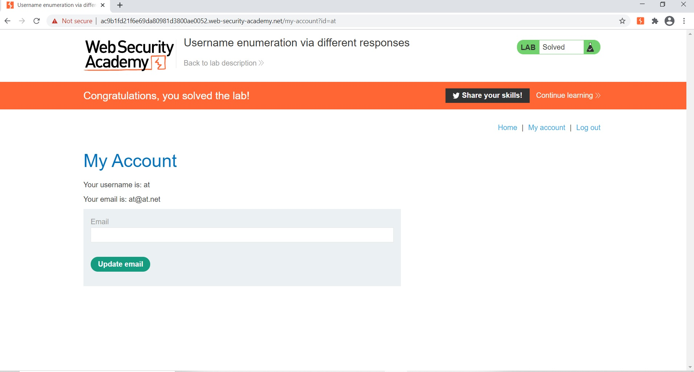
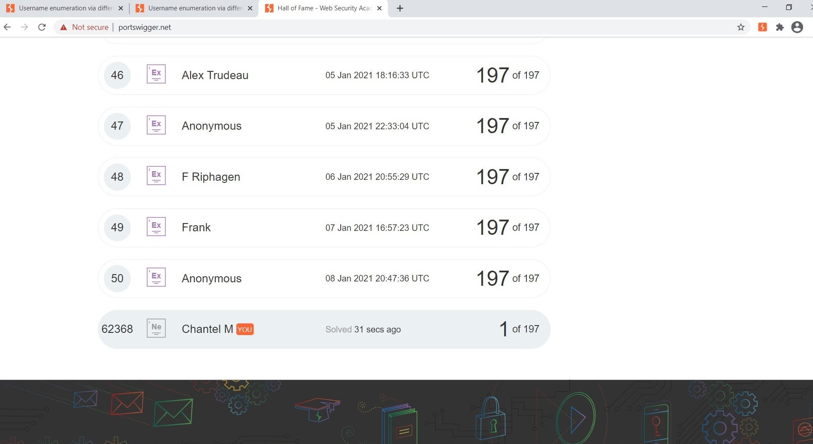

# CodePath Cybersecurity Pre-work:
## Brute Force Attack

### Mission:
Hack into a blog using brute force username and password enumeration.

### Tools used:
Burp Suite Community Edition - Intruder Tool\
Portswigger's Username Enumeration Lab

### Process:
After obtaining a list of potential usernames and passwords, utilize the intruder tool to repeat login attempts. By reviewing the responses, a correct username and password can be determined by isolating those responses that differ from the others. In this case, a correct username respone header is alonger length compared to incorrect usernames. Additionally, when a found username is combined with the correct password, the returned status code signals a successful redirection to a new page.

Once completed, you have access to an account and have successfully hacked into the blog...

##### Proof of completion:

##### Notes:
As someone who is new to cybersecurity, I thoroughly enjoyed this introduction. The instructions were useful for completion, but I was pleasantly surprised to find the entire process interesting. From learning about Burp Suite and how it compares and differs from packet sniffers to finally diving into protocols and status codes, this well thought out exercise and the instructions provided made the experience more enjoyable and less intimidating.
